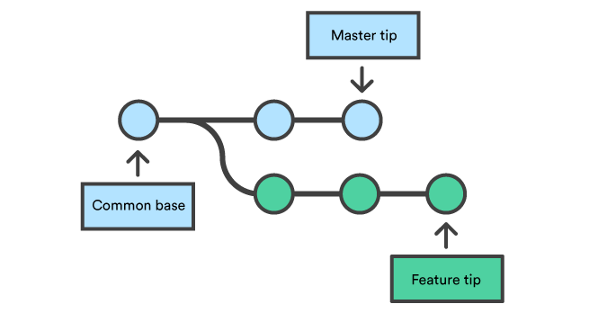

# Git (version control system)
সাধারণত কোডের রিভিশন রাখার জন্য গিট ব্যাবহার করা হয় । ভার্সন কন্টোল হচ্ছে এমন একটি পদ্ধতি যা আপনার প্রজেক্টের(project) বিভিন্ন সময়ের পরিবর্তনগুলো সংরক্ষণ করে রাখে। গিটে ডিরেক্টরিকেই ব্যাসিকালি রিপোজিটরি (Repository) বা শর্টকাটে অনেকে ‘রিপো (Repo)’ বলে।

# ভার্সন কন্ট্রোল সিস্টেমের প্রকারভেদ :

1. Centralized version control system(CVCS)
2. Distributed version control system(DVCS)

### CVCS :
একটি কেন্দ্রীয় সার্ভারে আপলোড করা থাকে সব ফাইল, ব্যাবহারকারির কাছে কোন কপি থাকে না । CVCS এর প্রধান অসুবিধা হল কোন কারণে কেন্দ্রীয় host ক্ষতিগ্রস্ত হলে পুরো প্রজেক্ট ক্ষতিগ্রস্ত হবে । জনপ্রিয় সার্ভার গুলো হল : একুরেভ, ক্লিয়ার কেস , সাব ার্সন , পারফরস ইত্যাদি 

### DVCS : 
সকল ব্যাবহারকারী নিজ নিজ কম্পিউটারে পুরো প্রজেক্ট টি কপি করে নেয় এবং লোকাল কম্পিউটারে প্রয়োজনীয় এডিটিং এর কাজ করা হয় তারপর কেন্দ্রীয় সার্ভারে টা আপলোড করা হয় । এর প্রধান সুবিধা হল কেন্দ্রীয় সার্ভার বা কোন ব্যাবহারকারীর কম্পিউটারে থাকা প্রজেক্ট corrupt হয়ে গেলে অন্য কোন কম্পিউটারে থাকা প্রজেক্ট থেকে restore করা যায় । জনপ্রিয় DVCS গুলো হল গিট, মারকিউরেল, জিএনইউ বাজার, মিত, বিটবাকেট ইত্যাদি । 


## গিট কমান্ড 

1. `git init` -একটি নতুন রিপোজিটরি(repository) তৈরি করার জন্য।

2. `git clone` – পূর্ব থেকে বিদ্যমান কোন রিপোজিটরির সম্পূর্ণ তথ্য ডাউনলোড করার জন্য

3. `git commit` – অফলাইন(offline) রিপোজিটরিতে স্থায়ীভাবে কাজ সংযুক্ত করার জন্য অর্থাৎ যে কাজ করলাম সেটা রেজিস্টার বা রেকর্ড করা । 

4. `git pull` – রিমোট(remote) রিপোজিটরি থেকে ফাইল ডাউনলোড করে অফলাইন রিপোজিটরির সাথে merge করার জন্য

5. `git push` – অফলাইন রিপোজিটরি থেকে ফাইল রিমোট রিপোজিটরিতে আপলোড করার জন্য

## কাজের ধাপসমূহ : 


আমরা যখন লোকাল(local) রিপোজিটরিতে কোন পরিবর্তন করি তখন আমরা working directory-তে থাকি। git add কমান্ড দেয়ার পর সেটা staging area তে যায় এবং git commit কমান্ড দেয়ার পর সেটা স্থায়িভাবে লোকাল রিপোজিটরিতে যুক্ত হয়। পরবর্তিতে চাইলে সেটা রিমোট রিপোজিটরিতে git push কমান্ড দিয়ে আপলোড করে দেয়া যায়।

## গিট ইন্সটল :

> apt-get install git


## গিট কনফিগারেশন : 
গিট কনফিগার করার মূল উদ্দেশ্য হচ্ছে, আপনি যখন গিট এর মাধ্যমে কমিট(commit) করবেন তখন কমিটের সাথে সে আপনার তথ্য সংরক্ষণ করে রাখবে। কনফিগারেশনের সময় আপনাকে শুধু আপনার user name এবং email address বলে দিতে হবে।

> git config --global user.name "Your Name Here"
> 
> git config --global user.email "your_email@youremail.com"

আপনি কোন একটি রিপজিটরির জন্য গিটের গ্লোবাল কনফিগারেশনকে পরিবর্তন অথবা ওভাররাইট করতে পারেন। আপনি যদি কোন একটি রিপজিটরির জন্য name এবং email পরিবর্তন করতে চান তাহলে terminal দিয়ে রিপজিটরিতে গিয়ে নিচের কমান্ডগুলো দেন। 

> git config --local user.name "Your Name Here"
> 
> git config --local user.email "your_email@youremail.com"

এখনে আপনি যে নাম এবং ইমেইল দিবেন তা শধুমাত্র এই রিপোজিটরির জন্য কনফিগার হবে। আপনার লোকাল কনফিগার .git/config ফাইল এ সংরক্ষিত হয়। Linux/Mac ব্যবহারকারীরা terminal-এ নিচের কমান্ড দিয়ে লোকাল কনফিগারেশন এর ফাইলটি দেখতে পারেন। 

কিন্তু আপনি যদি চান একাধিক প্রজেক্টের জন্য একাধিক নাম ও ইমেইল থাকবে তাহলে global কীওয়ার্ড ও তার আগের হাইফেন দুটো কেটে দিন
```git
git config user.name "Jahangir alam"
git config user.email "droidjahangir@gmail.com"
```


> vim .git/config

আপনি নিচের কমান্ড দিয়ে আপনার গিট কনফিগারেশন একসাথে দেখতে পারবেন।

> git config --list

## গিটের ভার্সন দেখার জন্য নিচের কমান্ড ইউজ করা হয় 

> git --version

## গিটের বর্তমান অবস্তা দেখার জন্য নিচের কমান্ড ইউজ হয় 

> git status

গিট এ সাধারণত unix/linux এর সব ধরনের কমান্ড সাপোর্ট করে 

`ls` - কোন ফোল্ডারের কি কি ফাইল আছে সে গুলো দেখার জন্য 

`ls -al` - hidden ফাইল, ফোল্ডার যাই থাকুক না কেনও সব দেখাবে 

`clear` - bash ক্লিয়ার করার জন্য ইউজ করা হয় এই কমান্ড 

**Repository** র নাম সাধারণত ছোট হাতে অক্ষরে এবং একাধিক ওয়ার্ড থাকলে সাধারণত ড্যাশ(-) চিহ্ন দিয়ে আলাদা করা হয় (Conventional rule) 

কোন particular extention file গিটে অন্তর্ভুক্ত করতে না চাইলে .gitignore ফাইলে তা বলে দিতে হবে 
> touch .gitignore

এখন যে ফাইল এক্সটেনশন গিটে অন্তর্ভুক্ত করতে না চান সেটা এই ফাইলের মদ্ধে বলে দিতে হবে । এক্সাম্পল :
* .Ds_store
* .project
* .pyc


## ফাইল Create :
> echo "This is message" >> file-name.txt

যদি ভীম ইন্সটল থাকে তাহলে নিচের কমান্ড দিয়ে ফাইল এডিট করা যায় 
> vim \<file-name>

অথবা `touch \<file-name>` এই কমান্ড দিয়েও ফাইল ক্রিয়েট করা যায়

ফাইলের ভেতর কি আছে সেটা দেখার জন্য নিচের কমান্ড ইউজ হয় 
 > cat simpletext.txt

## ফাইল delete :
ফাইল ডিলিট করার জন্য নিচের কমান্ড ইউজ হয় 
> rm -rf file-name.txt অথবা 
>
> git rm file-name.txt

## Add :

`git add -A`  - stages All (new, modified, deleted)

`git add .`  - stages new and modified without deleted

`git add -u`  -  stages modified and deleted without new

particula কোন ফাইল এড করতে চাইলে নিচের মতো করে রেফারেন্স সহ দিয়ে দিতে হবে 
> git add file_name.txt

বা অন্য কোন ডিরেক্টরিতে থাকলে সেইটা বলে দিতে হবে । গিটে ফাইলে এড করা মানে হল স্টেজিং এরিয়াতে নিয়ে যাওয়া তারপরে ফাইল কমিট করতে হয় । 

স্টেজিং এরিয়া থেকে যে কোন ধরনের চেঞ্জ করা যায় সেটা git history কোন প্রভাব পরে না । 

## Commit :
```git
single file commit:
git commit -m "First commit, this is a message about file"

multiple file commit:
git commit -am "multiple commit, this is a message about those file" <file1.txt> <file2.txt>
```

nano বা vim টেক্সট এডিটর ইন্সটল থাকলে শুধু `git commit` লিখে ইন্টার দিলেই ঐ এডিটর ওপেন হবে, এখানেই ম্যাসেজ এডিট করতে পারবেন । 

মাল্টিপল ফাইল এড করার পড় কমিট দিলে সব ফাইলে একই কমিট এড হয়ে যাবে কিন্তু সিঙ্গেল ফাইল এড করার পড় শুধু সেই ফাইলে কমিট এড হবে ।

`git diff` কমান্ডটা দিলে কোন ফাইলে কি কি পরিবর্তন হয়েছে সেইটা দেখাবে 

`git diff <commit-log-number > <commit-log-number>`  দুইটা কমিটের মদ্ধে কি কি পার্থক্য আছে সেইটা দেখাবে 

`git log --grep=”<pattern>”` এই pattern টেক্সট এর সাথে যে কমিট ম্যাসেজটা মিলবে সেই কমিটটা খুঁজে নিয়ে আসবে 

ভুলে কোন কমিট দিয়ে ফেল্লে `reset` করতে হয় কিন্তু ঐ কমিটটা যদি `push` হয়ে যায় তাহলে আর ভুলেও `reset` করা যাবে না 

## Check log :

>git log

existent কোন ফাইলকে মডিফাই করলে সেই ফাইলটা untract হয়ে যায় তাই পুনরায় আবার স্টেজিং এরিয়াতে নিয়ে যেতে হয় অর্থাৎ add করতে হয় । 

`git log` কমান্ডটা দিলে এ পর্যন্ত যতবার কমিট করা হয়েছে তার লিস্ট দেখাবে । 

`git diff` কমান্ড এর মাদ্ধমে কি মিডিফাই হয়েছে সেটা দেখা যাবে (যদি staging বা add হয়ে যায় তাহলে এই কমান্ড কাজ করবে না )

`git diff --staged` staging বা add হয়ে যাওয়ার পরও মডিফাইটা দেখাবে 

`git log --online` এটা দিলে লগ সংক্ষেপে দেখাবে 

`git show <commit-id-number>` দিলে ঐ particular কমিটে কি চেঞ্জ হয়েছে সেইটা দেখাবে 

`git diff <commit-1-id> <commit-2-id>` দিলে ঐ দুইটা কমিটে কি পার্থক্য সেটা দেখাবে 

`git checkout <commit-id>` এই কমান্ড রান করলে প্রোজেক্ট master ব্রাঞ্চ থেকে আগের এই কমিটের ভার্শনে ফিরে যাবে। তবে অবশ্যই মাস্টার ব্রাঞ্চে থাকাকালে সবকিছু আপনার ট্র্যাক করা থাকতে হবে। কোনো ফাইল/ফোল্ডার আন-ট্র্যাকড থাকলে বা আন-কমিটেড থাকলে আপনি চেক-আউট করতে পারবেন না।

এখন আপনার বর্তমান ওয়ার্কিং ডিরেক্টরি আগের একটা ভার্শনে রয়েছে। কিন্তু আপনি যদি মাস্টার ব্রাঞ্চে যেতে চান তাহলে আবার চেক-আউট দিতে হবে এভাবে  `git checkout master`

`git checkout <commit-id-number> file.txt` শুধু ঐ ফাইলটা ঐ কমিটের স্টেট এ যাবে কিন্তু পুরো প্রজেক্টটা যাবে না 

`git checkout master -f` কোন একটা ফাইলকে পুরনো স্টেট এ নিয়ে গিয়েছি কিন্তু পরে আবার মনে পড়লো যে না ভুল হয়ে গেছে আগে যে ভাবে ছিল ওইভাবেই নিয়ে যাই তখন এই কমান্ড দিতে হবে । 

`git log -<limit>` লিমিটের এইখানে ৫ দিলে লাস্ট ৫ টা কমিট দেখাবে 


## Unstaging a file :
```git
git rm <file-name>
git reset <file-name>
``` 
rm কমান্ডটা ফাইলটাকে ডিলিট করে দিয়েছিলো এবং staging এরিয়াতে সেট করে দিয়েছিলো এরপর reset কমান্ড এর মাদ্ধমে ফাইলটাকে staging এরিয়া থেকে বের করে দিলো 

যেকোন tracked ফাইলকে untracked করার জন্য এই কমান্ড গুলো ইউজ হয় 

ভুলে কোন commit দিয়ে ফেল্লে reset দিতে হয় কিন্তু ঐ commit টা যদি `push` করা হয়ে যায় তাহলে আর ভুলেও যেন reset না করা হয় 

## Push :

যদি কোন ফোল্ডার git initialization করা না থাকে তাহলে নিচের কমান্ড টা ব্যাবহার করতে হবে 

> git clone \<url\>

আর যদি git initialize করা থাকে তাহলে শুধু রিমোটটা Add করতে হবে 

> git remote add origin \<url\>

origin এর জায়গান অন্য কোন নামেও রিমোট এড করা যেতে পারে । একটা প্রজেক্ট এ একাধিক রিমোট এড করা যায় ।

এর পড় কোন ফাইল কোন রিমোট এ পুশ করার জন্য নিচের কমান্ডটা ইউজ হয় 
> git push \<remote-name\> \<branch-name\> 

এখানে remote_name এর জায়গায় সাধারণত origin হয় কারণ যে কোন রিমোট সাধারণত ডিফল্টভাবে  অরিজিন নামেই সেভ হয় । 

আর branch_name এর জায়গায় সাধারণত master লিখতে হয়, তবে অন্য কোন ব্রাঞ্চ এ কাজ করলে সেই ব্রাঞ্চ এর নাম দিতে হয় 

# branch : 


> git branch \<branch-name>

নতুন কোন ব্রাঞ্চ তৈরি করতে গেলে এভাবে কমান্ড লিখতে হয়

> git branch

কয়টা ব্রাঞ্চ আছে সেটা চেক করতে গেলে এই কমান্ড দিতে হয় 

> git checkout \<branch-name>

অন্য কোন ব্রাঞ্চ এ যেতে চাইলে এভাবে কমান্ড দিতে হয় 

> git checkout -b \<branch-name> 

আমরা যদি চাই যে কোন ব্রাঞ্চ তৈরি করে সাথে সাথে ঐ ব্রাঞ্চ এ শিফট করতে তাহলে এই কমান্ড দিতে হয় 

>git branch -D \<branch-name>

কোন ব্রাঞ্চ ডিলিট করার জন্য এই কমান্ড দিতে হয় 

> git checkout master

`master branch` এ ফিরে যেতে এই কমান্ড দিতে হয় অর্থাৎ HEAD এ ফিরে আসে 

> git merge <branch-name> 

অন্য কোন ব্রাঞ্চ এ মডিফাই করা কোড গুলো মাসটার ব্রাঞ্চ এ merge করতে চাইলে এই কমান্ড দিতে হয় 

# Git reset :

Two types of git reset:

1. Soft reset
2. Hard reset

**Soft reset :** soft reset করলে যে কমিটে রিসেট করা হয়েছে সেই কমিটে যাবে কিন্তু কি চেঞ্জ হয়েছিলো ঐটা দেখাবে ইচ্ছা করলে পুনরায় রিষ্টর করা যাবে 
> git reset --soft \<commit-id>

> git diff HEAD 

দিলে ঐ পার্থক্য গুলো দেখাবে যে কি চেঞ্জ হয়েছিলো 

**Hard reset :** 

> git reset --hard \<commit-id>
> 
hard reset এ আগের কমিটের চেঞ্জ গুলো দেখাবে না । hard reset করার পর যদি মনে হয় ভুল হয়ে গেছে আগের কমিটে ফিরে যেতে হবে তখন `git reflog` দিতে হয় 

```git
git Head@{commit-id}
git reset --hard 
```
এই কমান্ড দিলেই ঐ কমিট এ ফিরে যাবে 

__soft reset হচ্ছে চেঞ্জ রেখে back এ যাওয়া আর hard reset হচ্ছে চেঞ্জ ফেলে দিয়ে back এ যাওয়া__

**শুধুমাত্র যেসব কমিট পুশ করা হয় নাই সেগুলো রিসেট করা যাবে কিন্তু যে সব কমিট পুশ করা হয়েছে ভুলেও সেগুলোতে reset করা যাবে না** 


# amend :

মনে করি,কোন ফাইলে কিছু কাজ করে কমিট দিয়েছি । আবার অন্য কোন ফাইলে কাজ করার পর মনে হল যে নতুন কোন কমিট দেওয়ার প্রয়োজন নাই ঠিক আগের ফাইলে যে কমিট টা দিয়েছি ঐটার সাথেই জোড়া লাগিয়ে দিবো তখন amend কমান্ড দিতে হয় । 

> git commit --amend

