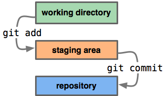

# Git (version control system)

## গিট কমান্ড 

1. `git init` -একটি নতুন রিপোজিটরি(repository) তৈরি করার জন্য।

2. `git clone` – পূর্ব থেকে বিদ্যমান কোন রিপোজিটরির সম্পূর্ণ তথ্য ডাউনলোড করার জন্য

3. `git commit` – অফলাইন(offline) রিপোজিটরিতে স্থায়ীভাবে কাজ সংযুক্ত করার জন্য

4. `git pull` – রিমোট(remote) রিপোজিটরি থেকে ফাইল ডাউনলোড করে অফলাইন রিপোজিটরির সাথে merge করার জন্য

5. `git push` – অফলাইন রিপোজিটরি থেকে ফাইল রিমোট রিপোজিটরিতে আপলোড করার জন্য

## কাজের ধাপসমূহ : 

আমরা যখন লোকাল(local) রিপোজিটরিতে কোন পরিবর্তন করি তখন আমরা working directory-তে থাকি। git add কমান্ড দেয়ার পর সেটা staging area তে যায় এবং git commit কমান্ড দেয়ার পর সেটা স্থায়িভাবে লোকাল রিপোজিটরিতে যুক্ত হয়। পরবর্তিতে চাইলে সেটা রিমোট রিপোজিটরিতে git push কমান্ড দিয়ে আপলোড করে দেয়া যায়।

## গিট ইন্সটল :

> apt-get install git

## গিট কনফিগারেশন : 
গিট কনফিগার করার মূল উদ্দেশ্য হচ্ছে, আপনি যখন গিট এর মাধ্যমে কমিট(commit) করবেন তখন কমিটের সাথে সে আপনার তথ্য সংরক্ষণ করে রাখবে। কনফিগারেশনের সময় আপনাকে শুধু আপনার user name এবং email address বলে দিতে হবে।

> git config --global user.name "Your Name Here"
> 
> git config --global user.email "your_email@youremail.com"

আপনি কোন একটি রিপজিটরির জন্য গিটের গ্লোবাল কনফিগারেশনকে পরিবর্তন অথবা ওভাররাইট করতে পারেন। আপনি যদি কোন একটি রিপজিটরির জন্য name এবং email পরিবর্তন করতে চান তাহলে terminal দিয়ে রিপজিটরিতে গিয়ে নিচের কমান্ডগুলো দেন। 

> git config --local user.name "Your Name Here"
> 
> git config --local user.email "your_email@youremail.com"

এখনে আপনি যে নাম এবং ইমেইল দিবেন তা শধুমাত্র এই রিপোজিটরির জন্য কনফিগার হবে। আপনার লোকাল কনফিগার .git/config ফাইল এ সংরক্ষিত হয়। Linux/Mac ব্যবহারকারীরা terminal-এ নিচের কমান্ড দিয়ে লোকাল কনফিগারেশন এর ফাইলটি দেখতে পারেন। 

> vim .git/config

আপনি নিচের কমান্ড দিয়ে আপনার গিট কনফিগারেশন একসাথে দেখতে পারবেন।

> git config --list

