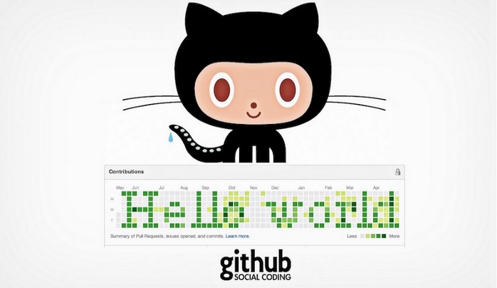
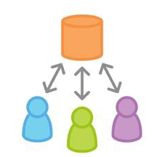
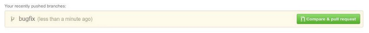
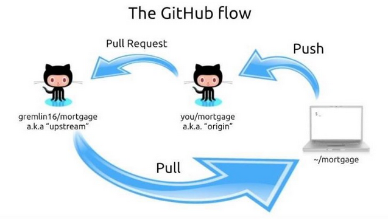

### মূল লেখা 
https://medium.com/%E0%A6%AA%E0%A7%8D%E0%A6%B0%E0%A7%8B%E0%A6%97%E0%A7%8D%E0%A6%B0%E0%A6%BE%E0%A6%AE%E0%A6%BF%E0%A6%82-%E0%A6%AA%E0%A6%BE%E0%A6%A4%E0%A6%BE/%E0%A6%97%E0%A6%BF%E0%A6%9F%E0%A6%B9%E0%A6%BE%E0%A6%AC%E0%A7%87-%E0%A6%93%E0%A6%AA%E0%A7%87%E0%A6%A8%E0%A6%B8%E0%A7%8B%E0%A6%B0%E0%A7%8D%E0%A6%B8-%E0%A6%AA%E0%A7%8D%E0%A6%B0%E0%A6%9C%E0%A7%87%E0%A6%95%E0%A7%8D%E0%A6%9F%E0%A7%87-%E0%A6%95%E0%A6%A8%E0%A7%8D%E0%A6%9F%E0%A7%8D%E0%A6%B0%E0%A6%BF%E0%A6%AC%E0%A6%BF%E0%A6%89%E0%A6%B6%E0%A6%A8%E0%A7%87%E0%A6%B0-%E0%A6%B8%E0%A6%B9%E0%A6%9C-%E0%A6%93%E0%A7%9F%E0%A6%BE%E0%A6%B0%E0%A7%8D%E0%A6%95%E0%A6%AB%E0%A7%8D%E0%A6%B2%E0%A7%8B-1a2d8b107391

# গিটহাবে ওপেনসোর্স প্রজেক্টে কন্ট্রিবিউশনের সহজ ওয়ার্কফ্লো



#### প্রথমেই বলে নেয়া ভালো যে, গিট বা গিটহাবের সাথে পরিচয় করিয়ে দেবার উদ্দেশ্যে এই লেখা না।

আমরা অনেকেই গিটহাবে বিভিন্ন ওপেনসোর্স প্রজেক্টে কন্ট্রিবিউট করার চেষ্টা করে থাকি। সাধারণভাবে নিজের কোনো একটা প্রোজেক্টের শুধুমাত্র ভার্সন কন্ট্রোল করার ওয়ার্কফ্লো, আর আরেকজনের প্রোজেক্টে কন্ট্রিবিউট করার ওয়ার্কফ্লোটায় কিছু পার্থক্য আছে।

যখন শুধুমাত্র নিজের একার প্রোজেক্টের ভার্সন কন্ট্রোল করা হয়, সেটা আসলে একেবারে দুধ-ভাত টাইপের ব্যাপার।

* প্রোজেক্টে গিট ইনিশিয়ালাইজ করো
* কাজ করো
* `git add` করো
* `git commit` করো
* `git push` করো

লোকাল এনভায়রনমেন্ট বা মেশিন চেঞ্জ না করলে পারতপক্ষে git pull ও করা লাগে না কখনো। ব্রাঞ্চ করলে করলাম, না করলে নাই।


টীমে কাজ করলেও কিছু ব্রাঞ্চিং, `git pull` করে লোকালি অন্যদের আপডেট sync করা, মাঝে মাঝে **merge conflict** রিসল্ভ করা লাগে। তো যারা টীমে কাজ করে, তারা এই ব্যাপারগুলো কাজ করতে করতে শিখে নেয়।

যেটা কিছুটা সমস্যা হয়, সেটা হলো গিয়ে গিটহাবে অন্যকারো ওপেনসোর্স প্রোজেক্টে কন্ট্রিবিউট করতে গেলে। ব্যাপার হচ্ছে, এখানেও আপনি আপনার মতো করে যেভাবে ইচ্ছা কোনোমতে কাজ সারতে পারবেন। কেউ না করবে না। কিন্তু তারপরো, কাজের সৌন্দর্য বলে একটা ব্যাপার আছে না? তার জন্যই কিভাবে এই কাজটা করা ভালো সেটা একটু বলার চেষ্টা করি।


প্রথমেই যেই ব্যাপারটা মাথায় রাখতে হবে সেটা হলো নিজের প্রোজেক্টে বা টীমের প্রোজেক্টে আমাদের প্রোজেক্টের **Remote Repository** থাকে একটা (যেটা [github](https://github.com/) বা [bitbucket](https://bitbucket.org/) এর মত সাইটে হোস্ট করা থাকে)। প্রোজেক্টের ডেভেলপাররা সবাই সেখান থেকে কোড `pull` করে নেয়, আর কাজ করে আবার সেখানেই `push` করে। এবং এক্ষেত্রে ডেভেলপারদের সবারই **Remote Repository** টাতে **write access** থাকে, অর্থাৎ তারা কোডে সরাসরি চেঞ্জ করার পারমিশন পায়। এই Remote Repository টাকে ডেভেলপাররা নিজেদের লোকাল রিপোজিটরিতে **origin** নামে সেভ করে রাখে। আপনার প্রোজেক্টের লোকাল রিপোজিটরিতে গিয়ে আপনি নীচের কমান্ডটি দিয়ে দেখতে পারবেন আপনার প্রোজেক্টের Remote Repository কোনটি।

> git remote -v




অন্য কারো ওপেনসোর্স প্রোজেক্টে কন্ট্রিবিউশনে মূলত এই পার্থক্যটাই মুখ্য। সেই রিপোজিটরিতে আপনাকে সরাসরি **write access** দেয়া নেই, একারণে আপনি সরাসরি ঐ প্রোজেক্টের কোড নিজের লোকাল মেশিনে `clone` করে, চেঞ্জ করে ঐ রিপোজিটরিতে `push` করতে পারবেন না। তাহলে কিভাবে কি করতে হবে? সেটার জন্যই এতো ত্যানা প্যাঁচানো। আসেন এবার কাজের কথায় যাই।

মনে করি Hasan Abdullah এর একটা প্রোজেক্ট গিটহাবে আছে যার নাম ‘learn-coding’, এবং এটায় আমি কন্ট্রিবিউট করতে চাই। তাহলে আমাকে কি করতে হবে?

* প্রথমে আমি গিটহাবে হাসানের ঐ প্রোজেক্টের পেইজে গিয়ে ওর প্রোজেক্টটাকে `fork` করবো।


`Fork` করার ফলে যেটা হলো যে গিটহাবে হাসানের প্রোজেক্টের একটা `clone` আমার একাউন্টে তৈরি হলো, যেটার owner আমি। অর্থাৎ এখন আমার একাউন্টে একটা নতুন প্রোজেক্ট তৈরি হয়ে গেছে ‘learn-coding’ নামে। যেহেতু এই forked প্রোজেক্টের owner আমি, সুতরাং আমি এইখানে যা ইচ্ছা তাই করতে পারবো। ইচ্ছা করলে এই প্রোজেক্টে হাসানের করা আগের সব কাজ মুছে দিয়ে সব আমি আবার নতুন করেও করতে পারবো। কিন্তু মজার ব্যাপার হচ্ছে, আমার এইখানে করা কোনো চেঞ্জের কারণে হাসানের মূল প্রোজেক্ট ‘learn-coding’ এ কোনো চেঞ্জ হবে না, কারণ ২ টা এখন সম্পূর্ণ ভিন্ন ২ টা প্রোজেক্টের মত অবস্থায় আছে।

কিন্তু আমি তো আসলে হাসানের প্রোজেক্ট fork করেছি সেইখানে আমার কিছু কাজ যুক্ত করার জন্য, তাই না? সেটাই এখন করতে যাচ্ছি। আবারও একবার বলি-

## *হাসানের ‘learn-coding’ টা হচ্ছে মেইন প্রোজেক্ট আর আমার ‘learn-coding’ টা হচ্ছে forked প্রোজেক্ট*

* এবার আমি আমার forked প্রোজেক্টটাকে আমার লোকাল মেশিনে clone করবো।

> git clone git@github.com:shaon/learn-coding.git

* আমার এই ক্লোন করা প্রোজেক্টে কিন্তু অলরেডি Remote হিসেবে আমার গিটহাবের forked প্রোজেক্টের লিংক সেট হয়ে গেছে। দেখতে চাইলে-

> git remote -v
এবং এখানে আমি দেখবো যে এই রিমোট রিপোজিটরীটা `origin` নামে আছে।

* আগেই বলেছি হাসানের ‘learn-coding’ রিপোজিটরিতে আমি সরাসরি কোনো `push` করতে পারবো না। আবার আমার লোকাল মেশিনে আমি ক্লোন করেছি আমার `forked` রিপোজিটরী থেকে, সুতরাং আমি যদি পরবর্তীতে `pull/fetch` করি সেটা আমার `forked` রিপোজিটরী থেকে আপডেট নিবে। তাহলে আমি `fork` করার পর হাসান যেসব সুন্দর সুন্দর কোড তার রিপোজিটরীতে যুক্ত করবে আমি সেই আপডেটগুলো কিভাবে পাবো? হ্যাঁ, সেটার জন্যই আমার লোকাল রিপোজিটরীতে আমি হাসানের মেইন প্রোজেক্টের লিংকটাও `Remote` হিসেবে রাখবো।

> git remote add upstream git@github.com:hasan/learn-coding.git

এখানে হাসানের রিপোজিটরীটাকে আমি সেভ করছি upstream নামে। তারমানে আমার লোকাল রিপোজিটরীতে এখন ২ টা রিমোট লিংক আছেঃ

1. **origin** — আমার forked প্রজেক্ট যেটা গিটহাবে আছে

2. **upstream** — হাসানের মেইন প্রজেক্ট যেটা গিটহাবে আছে

এরপরের কাজ মোটামুটি সোজাই।

* কাজ শুরু করার আগে ভালো হয় হাসানের মূল প্রজেক্ট থেকে আমার লোকাল প্রোজেক্টে আরেকবার আপডেট নিয়ে নিলে, বলা তো যায় না এতো কথার মাঝে ও কোনো `push` দিয়ে দিয়েছে কিনা।

> git pull upstream master

এখানে `master` হচ্ছে হাসানের মূল প্রোজেক্টের `master` ব্রাঞ্চ, সেখান থেকেই আমি আপডেট নিলাম। তারমানে আমার লোকাল রিপোজিটরীর `master` ব্রাঞ্চ আর হাসানের মূল প্রোজেক্টের `master` ব্রাঞ্চ এখন `sync` আছে।

* এখন আমি হাসানের প্রজেক্টে কি কন্ট্রিবিউশন করবো? হতে পারে আমি সেখানে কোনো একটা বাগফিক্স করতে চাই, তাহলে আমি আমার লোকালে একটা নতুন ব্রাঞ্চ খুলে সেখানে `checkout` করি।

> git checkout -b bugfix

এই সিঙ্গেল কমান্ডে `bugfix` নামে একটা নতুন ব্রাঞ্চ তৈরি হবে এবং সেখানে `checkout` ও হয়ে যাবে। তারমানে আমি এখন আমার লোকালে `bugfix` ব্রাঞ্চে আছি। (আমি যদি বাগফিক্স না করে নতুন কোনো ফীচার নিয়ে কাজ করতে চাইতাম তাহলে হয়তো আমি **feature-name** নামে ব্রাঞ্চ খুলতাম। বা হাসানের রিপোজিটরির কোনো একটা রিপোর্টেড ইস্যু সল্ভ করার জন্য fix-issue-213 নামে ব্রাঞ্চ হতে পারতো। কি করতে চাচ্ছি সেই হিসাবে ব্রাঞ্চের নাম হলে ভালো হয়, খেয়াল রাখতে হবে একই নামে একাধিক ব্রাঞ্চ কিন্তু খোলা যাবে না)


* এখন আমার যা কাজ করার তা করে আমি `add` করে `commit` করলাম। আমার চেঞ্জ কিন্তু এখনো আমার লোকালে `bugfix` ব্রাঞ্চেই আছে। এখন আমি চাই আমার চেঞ্জটুকু হাসানের মূল প্রজেক্টে যুক্ত করতে। তার জন্য আমি আমার চেঞ্জটুকু দিয়ে হাসানের মূল প্রজেক্টে `Pull Request` করবো যাতে হাসান তার প্রজেক্টে আমার এই চেঞ্জটুকু এড করে নেয়। আগেই বলেছি যেহেতু হাসানের প্রজেক্টে আমার _write access_ নেই, তাই হাসানের পারমিশনের জন্যই মূলত এই `Pull Request` প্রসেস। তার আগে আরেকটা ছোটো কাজ করে নেয়া ভালো। তা হলো যদি আমার এই কাজের ফাঁকেই হাসান আবার কোনো `push` দিয়ে থাকে ওর রিপোজিটরীতে? তাহলে আমার master বা bugfix ব্রাঞ্চ দুটোই কিন্তু __ব্যাকডেটেড__ হয়ে গেছে। এখন আমি আরেকবার হাসানের মূল প্রজেক্টের `master` ব্রাঞ্চ থেকে আপডেট নিবো `bugfix` ব্রাঞ্চে থেকেই।

> git pull --rebase upstream master

**rebase** মূলত হাসানের নতুন আপডেটের সাথে আমার চেঞ্জটুকু সামঞ্জস্যপূর্ণ কিনা সেটা চেক করে আমার চেঞ্জ কমিটগুলোকে হাসানের আপডেট কমিটগুলোর পরে যুক্ত করে দেয়। যদি এই আপডেটের কারণে আমার কোডে কোনো `merge conflict` হয়, সেটা আমার লোকালি আমি ফিক্স করে আরেকটা `commit` করবো। আর যদি `conflict` না থাকে তাহলে তো __আলহামদুলিল্লাহ্‌।__

* এইবার আমি আমার `bugfix` ব্রাঞ্চে থেকেই আমার গিটহাবের `forked` রিপোজিটরীতে আমার চেঞ্জগুলো push করবো (কারণ আমি সরাসরি হাসানের রিপোজিটরীতে `push` করতে পারবো না)।

> git push origin bugfix


এবার আমি গিটহাবে আমার এই প্রোজেক্টের পেইজে গেলেই দেখবো সবুজ রঙের একটা বাটন, যেটা দিয়ে আমি হাসানের প্রোজেক্টে `Pull Request` করতে পারবো।



ব্যস কাজ হয়ে গেলো, আমার আর তেমন কিছুই করার নাই। হাসানের মন চাইলে হাসান এই `Pull Request` এক্সেপ্ট ও করতে পারে, কিংবা মনঃপুত না হলে ক্লোজ ও করে দিতে পারে।

### সহজভাবে পুরো ওয়ার্কফ্লোটা এই রকম-



এখন হাসান এক্সেপ্ট করুক আর না করুক, আমি চাইলে এই চেঞ্জটুকু আমার `forked` রিপোজিটরীর `master` ব্রাঞ্চে যোগ করে দিতে পারি (খেয়াল রাখতে হবে, এতে করে হাসানের মূল রিপোজিটরী আর আমার `forked` রিপোজিটরী একই অবস্থায় `sync` থাকবে না)। একাজ করার জন্য আমি আমার লোকাল `bugfix` ব্রাঞ্চকে লোকাল `master` ব্রাঞ্চের সাথে `merge` করে আমার গিটহাবের `forked` রিপোজিটরীতে `push` করতে পারি।

```git
    git checkout master
    git merge bugfix
    git push origin master
```

এছাড়া আমি যদি আমার পুল রিকোয়েস্টের উপর হাসানের একশনের পরে, কিংবা পরবর্তীতে অন্য কোনো সময় হাসানের মূল রিপোজিটরীর সাথে আমার `forked` রিপোজিটরী `sync` করতে চাই, তাহলে লোকালে আমার `master` ব্রাঞ্চে গিয়ে -

```git
    git pull upstream master
    git push origin master
```

আমি যদি আবারও অন্য কোনো একটা বাগফিক্স বা ফিচার নিয়ে কাজ করতে চাই, তাহলে নতুন করে আরেকটা ব্রাঞ্চ বানাবো লোকালি (অবশ্যই আগের বাগফিক্স ব্রাঞ্চে গিয়ে কাজ শুরু করে দিবো না) এবং একইভাবে বাকি কাজ গুলো করবো। আলাদা আলাদা বাগফিক্স, ফিচারের জন্য অবশ্যই আলাদা আলাদা ব্রাঞ্চে কাজ করে সেই ব্রাঞ্চগুলো থেকে আলাদা আলাদা `Pull Request` পাঠাতে হবে। এই ব্যাপারটা প্রথম দিকে আমিও ফলো করতাম না, কিন্তু এইটাই সবচাইতে ভালো পদ্ধতি।

আরেকটা ছোটো বিষয়, এই যে আমি ভিন্ন ভিন্ন ব্রাঞ্চ বানিয়ে কাজ করছি, আমার পুল রিকোয়েস্ট এক্সেপ্ট/ডিনাই হয়ে গেলে এই ব্রাঞ্চগুলোর তো আর কোনো দরকার থাকছে না। তখন আমি এইগুলো ডিলিট করে দিবো।

লোকালি ব্রাঞ্চ ডিলিট করবো-

> git branch -d bugfix

আর গিটহাবের আমার রিপোজিটরির রিমোট ব্রাঞ্চ ডিলিট করতে-

> git push origin bugfix


বিরাট উপন্যাস ফেঁদে বসে আছি মনে হচ্ছে। যদিও নতুনদের জন্য স্টেপগুলো সহজভাবে বুঝানোর জন্য এত কথা বলা, মূল স্টেপ কিন্তু আসলে অল্প কয়টা। আর একবার অভ্যস্ত হয়ে গেলে, পরে এমনিতেই ব্যাপারটা সহজ হয়ে যাবে। আর কেউ কেউ হয়তো গিট মেইন্টেইনের জন্য কোনো **GUI software** ব্যবহার করে থাকতে পারেন, সে ক্ষেত্রে উপরের গিটের কমান্ডগুলো আপনার ঐ **GUI software** থেকে আরো সহজেই এক্সিকিউট করতে পারবেন। আমি গিট *terminal* থেকে ব্যবহার করেই অভ্যস্ত (হয়তো আরো অনেকেই)। তাদের জন্য কমান্ডগুলো বেশী কাজে লাগবে।
