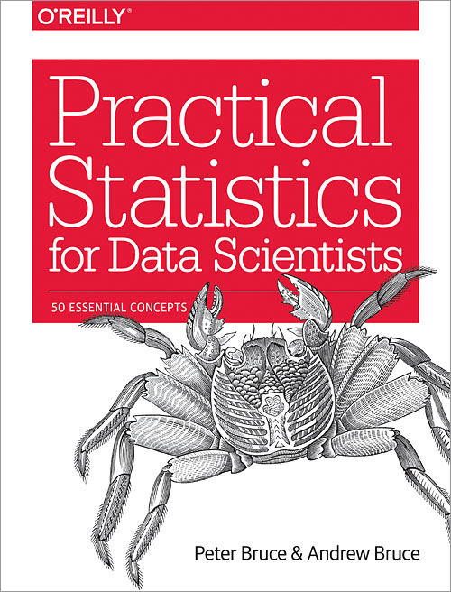

# ব্লকচেইন 

* [hackernoon/ WTF is the blockchain](https://hackernoon.com/wtf-is-the-blockchain-1da89ba19348)

# গিট 

* [Medium/ প্রোগ্রামিং পাতা/ এক পলকে গিট](https://medium.com/%E0%A6%AA%E0%A7%8D%E0%A6%B0%E0%A7%8B%E0%A6%97%E0%A7%8D%E0%A6%B0%E0%A6%BE%E0%A6%AE%E0%A6%BF%E0%A6%82-%E0%A6%AA%E0%A6%BE%E0%A6%A4%E0%A6%BE/%E0%A6%8F%E0%A6%95-%E0%A6%AA%E0%A6%B2%E0%A6%95%E0%A7%87-%E0%A6%97%E0%A6%BF%E0%A6%9F-git-%E0%A6%93-%E0%A6%97%E0%A6%BF%E0%A6%9F%E0%A6%B9%E0%A6%BE%E0%A6%AC-github-%E0%A6%AA%E0%A6%B0%E0%A7%8D%E0%A6%AC-%E0%A7%A7-%E0%A7%A9-90c0f6892d0f)

* [git.howtocode.com](https://git.howtocode.com.bd/3-new-repo.html)

* [Youtube/ হাসিন হায়দার](https://www.youtube.com/watch?v=M2a7OQX8te4&list=PLoR56CteKZnC0lBlHdnVnq0J3yDhgbi9w)

* [Youtube/ Corey Schafer](https://www.youtube.com/watch?v=HVsySz-h9r4&t=1508s)

* [git bitbucket](https://www.atlassian.com/git/tutorials/setting-up-a-repository)

# আর্টিফিশিয়াল ইন্টেলিজেন্স

* [‘আ’ তে আর্টিফিশিয়াল ইন্টেলিজেন্স! ](https://medium.com/@reyadrahman/%E0%A6%86-%E0%A6%A4%E0%A7%87-%E0%A6%86%E0%A6%B0%E0%A7%8D%E0%A6%9F%E0%A6%BF%E0%A6%AB%E0%A6%BF%E0%A6%B6%E0%A6%BF%E0%A7%9F%E0%A6%BE%E0%A6%B2-%E0%A6%87%E0%A6%A8%E0%A7%8D%E0%A6%9F%E0%A7%87%E0%A6%B2%E0%A6%BF%E0%A6%9C%E0%A7%87%E0%A6%A8%E0%A7%8D%E0%A6%B8-1d6c092da1c6)

# ডাটা সাইন্স 

* [ডেটা সায়েন্টিস্ট হওয়ার প্রস্ততি - Enayet Raheem ](https://medium.com/@raheems/%E0%A6%A1%E0%A7%87%E0%A6%9F%E0%A6%BE-%E0%A6%B8%E0%A6%BE%E0%A7%9F%E0%A7%87%E0%A6%A8%E0%A7%8D%E0%A6%9F%E0%A6%BF%E0%A6%B8%E0%A7%8D%E0%A6%9F-%E0%A6%B9%E0%A6%93%E0%A7%9F%E0%A6%BE%E0%A6%B0-%E0%A6%AA%E0%A7%8D%E0%A6%B0%E0%A6%B8%E0%A7%8D%E0%A6%A4%E0%A6%A4%E0%A6%BF-978e37eff0dc)
* [data science, machine learning, SQL, Statistics, Calculus, Linear algebra etc](https://www.dataquest.io/path/data-scientist)
* [Overview of Exploratory Data Analysis With Python](https://hackernoon.com/overview-of-exploratory-data-analysis-with-python-6213e105b00b)

* [Top 8 resources for learning data analysis with pandas](https://www.dataschool.io/best-python-pandas-resources/)

* [How to land a Data Scientist job at your dream company](https://towardsdatascience.com/how-to-land-a-data-scientist-job-at-your-dream-company-my-journey-to-airbnb-f6a1e99892e8)

# মেশিন লার্নিং 

* [হাতে কলমে মেশিন লার্নিং](https://raqueeb.gitbooks.io/mlbook-titanic/)
* [পাইথন ও ম্যাটল্যাবে মেশিন লার্নিং](http://ml.howtocode.com.bd/)
* [Machine learning in Python with scikit-learn](https://www.youtube.com/watch?v=elojMnjn4kk&list=PL5-da3qGB5ICeMbQuqbbCOQWcS6OYBr5A)
* [ Andrew Ng - Machine learning](https://www.coursera.org/learn/machine-learning)
* [সম্ভাবনাময় মেশিন লার্নিং শুরুর কিছু পথ-নির্দেশিকা](https://medium.com/@harunshimanto/%E0%A6%B8%E0%A6%AE%E0%A7%8D%E0%A6%AD%E0%A6%BE%E0%A6%AC%E0%A6%A8%E0%A6%BE%E0%A6%AE%E0%A7%9F-%E0%A6%AE%E0%A7%87%E0%A6%B6%E0%A6%BF%E0%A6%A8-%E0%A6%B2%E0%A6%BE%E0%A6%B0%E0%A7%8D%E0%A6%A8%E0%A6%BF%E0%A6%82-%E0%A6%B6%E0%A7%81%E0%A6%B0%E0%A7%81%E0%A6%B0-%E0%A6%95%E0%A6%BF%E0%A6%9B%E0%A7%81-%E0%A6%AA%E0%A6%A5-%E0%A6%A8%E0%A6%BF%E0%A6%B0%E0%A7%8D%E0%A6%A6%E0%A7%87%E0%A6%B6%E0%A6%BF%E0%A6%95%E0%A6%BE-1532f57cee49)
* [Machine Learning Cheatsheet](https://ml-cheatsheet.readthedocs.io/en/latest/)

## আর্টিকেল :

  * [A Complete Machine Learning Project Walk-Through in Python: Part One](https://towardsdatascience.com/a-complete-machine-learning-walk-through-in-python-part-one-c62152f39420)

### লিনিয়ার রিগ্রেসন :
* [Simple and Multiple Linear Regression in Python](https://towardsdatascience.com/simple-and-multiple-linear-regression-in-python-c928425168f9)

### লজিস্টিক রিগ্রেসন :
* [Logistic Regression — Detailed Overview](https://towardsdatascience.com/logistic-regression-detailed-overview-46c4da4303bc) 

# লিনিয়ার এলজেব্রা :

### ইউটিউব & অনলাইন কোর্স 

* [Essence of linear algebra](https://www.youtube.com/watch?v=kjBOesZCoqc&list=PLZHQObOWTQDPD3MizzM2xVFitgF8hE_ab)
* [MIT 18.06 Linear Algebra, Spring 2005 - Instructor: Prof. Gilbert Strang ](https://www.youtube.com/playlist?list=PLE7DDD91010BC51F8)

### আর্টিকেল 

* [linear algebra - medium all article](https://medium.com/search?q=linear%20algebra) 
* [Basic Linear Algebra for Deep Learning](https://towardsdatascience.com/linear-algebra-for-deep-learning-f21d7e7d7f23)
* [Deep Learning Book Notes, Chapter 2: Linear Algebra for Deep Learning - medium](https://becominghuman.ai/deep-learning-book-notes-chapter-2-linear-algebra-for-deep-learning-af776cf52506)
* [Boost your data science skills. Learn linear algebra.](https://towardsdatascience.com/boost-your-data-sciences-skills-learn-linear-algebra-2c30fdd008cf)
* [Linear algebra cheat sheet for deep learning](https://towardsdatascience.com/linear-algebra-cheat-sheet-for-deep-learning-cd67aba4526c)

# ক্যালকুলাস :

* [ খান একাডেমী - Differential equations](https://www.khanacademy.org/math/differential-equations)

* [খান একাডেমী - Multivariable calculus](https://www.khanacademy.org/math/multivariable-calculus)

# স্ট্যাটিস্টিক্স 

* [খান একাডেমী - Statistics and probability](https://www.khanacademy.org/math/statistics-probability)

* [Introduction to Probability - The Science of Uncertainty - edx](https://www.edx.org/course/introduction-probability-science-mitx-6-041x-2)

* [statistecs - udacity](https://classroom.udacity.com/courses/st101)

* [Course: Probability Theory and Statistics for Programmers](https://medium.com/@geekrodion/course-probability-theory-and-statistics-for-programmers-353e20202620)

* [Cursera - duke University : Statistics with R Specialization](https://www.coursera.org/specializations/statistics)

* [19 MOOCs on Mathematics & Statistics for Data Science & Machine Learning](https://www.analyticsvidhya.com/blog/2017/01/19-mooc-mathematics-statistics-datascience-machine-learning/)

* [openIntro](https://www.openintro.org/stat/index.php) 

* [datacamp](https://www.datacamp.com/courses/topic:probablity_and_statistics)

* [San jose state university](https://www.udacity.com/course/statistics--st095)

## Article : 
* [statistics for machine learning - medium all article](https://medium.com/search?q=statistics%20for%20machine%20learning)
* [Quick Intro to Statistics — Power Your Stories with Data](https://hackernoon.com/quick-intro-to-statistics-power-your-stories-with-data-a3a35785692b)
* [Course: Probability Theory and Statistics for Programmers](https://medium.com/@geekrodion/course-probability-theory-and-statistics-for-programmers-353e20202620)

#### Descriptive statistics:

1. [Intro to Descriptive Statistics-Niklas Donges](https://towardsdatascience.com/intro-to-descriptive-statistics-252e9c464ac9)
2. [Understanding Descriptive Statistics-Sarang Narkhede](https://towardsdatascience.com/understanding-descriptive-statistics-c9c2b0641291)

#### distribution

1. [Common Probability Distributions: The Data Scientist’s Crib Sheet](https://medium.com/@srowen/common-probability-distributions-347e6b945ce4)

2. [6 Common Probability Distributions every data science professional should know](https://www.analyticsvidhya.com/blog/2017/09/6-probability-distributions-data-science/)

#### probability
1. [Probability concepts explained: Maximum likelihood estimation](https://towardsdatascience.com/probability-concepts-explained-maximum-likelihood-estimation-c7b4342fdbb1)
2. [Probability Distributions](https://onlinecourses.science.psu.edu/stat500/node/21/)
3. [Probability concepts explained: Introduction](https://towardsdatascience.com/probability-concepts-explained-introduction-a7c0316de465)

# পাইথন :

* [পাইথন - howtocode.com.bd](http://python.howtocode.com.bd/)

* [thinkdiff - Python Beginners](https://www.youtube.com/watch?v=qcRlYt28WPM&list=PLlMOodDAsO4y8_pYiKnweAz0MjR61VByU)

* [thinkdiff - python advanced](https://www.youtube.com/watch?v=k1rFag1W2WM&list=PLlMOodDAsO4xkdJ6Qr1-ZsyyPLiZ1J3Bq)

* [python - MIT](https://www.youtube.com/watch?v=ytpJdnlu9ug&list=PLUl4u3cNGP63WbdFxL8giv4yhgdMGaZNA)

* [Book - Automate the Boring Stuff with Python:](https://www.google.com/search?client=ubuntu&channel=fs&q=automate+the+boring+stuff+with+python&ie=utf-8&oe=utf-8)

# Article 

* [রকিবের সাথে মেশিন লার্নিং ২, পাইথন](http://nbviewer.jupyter.org/github/raqueeb/ml-python/blob/master/test-scikit-learn.ipynb?fbclid=IwAR3SM0CiMdSA6Xs21g5Kl-YhfJ8RSqITHEUnMKY0Indp6iCzInQObc7XH-g)

# Python problem solving

* [Hackerrank](https://www.hackerrank.com/domains/python)
* [Github - 100+ Python challenging programming exercises](https://github.com/zhiwehu/Python-programming-exercises/blob/master/100%2B%20Python%20challenging%20programming%20exercises.txt)
* [Python Exercises, Practice, Solution](https://www.w3resource.com/python-exercises/)

# python package management

* [Which Python package manager should you use?](https://towardsdatascience.com/which-python-package-manager-should-you-use-d0fd0789a250)

# নেটওয়ার্কিং 

* [CSLCBT Bangla - youtube](https://www.youtube.com/user/CSLCBT/playlists)
*  [দ্বিমিক কম্পিউটিং - Dimik Computing networking - youtube](https://www.youtube.com/watch?v=OfGuohbxDNo&list=PLjq9G-RJFRrYwU2xgRG4KWLzEoZYLxb6L)

# ডাটাবেজ 

* [Jompesh Education - youtube](https://www.youtube.com/watch?v=aPNy1eusjFg&list=PLgzGtvkMZr9l4HeUwpGH6MWnCH3PGn-ic)
* [Anisul Islam - MySQL Database Bangla Tutorials - youtube](https://www.youtube.com/watch?v=1IQbPxFkoiQ&list=PLgH5QX0i9K3qLcx9DvVDWmNJ7riPvxzCD)

## PostgreSQL
* [PostgreSQL bangla tutorial - youtube](https://www.youtube.com/watch?v=Z87TYm807Is&index=2&list=PLbC4KRSNcMnp3nLrE7WcFPI_tLJ0qH3aq)

# Medium writter :

* [william koehrsen](https://medium.com/@williamkoehrsen)

# Youtube channel : 

* [Physics Videos by Eugene Khutoryansky](https://www.youtube.com/user/EugeneKhutoryansky/playlists)

# Deep learning :

* [Deep Learning - Goodfellow](http://www.deeplearningbook.org/)

